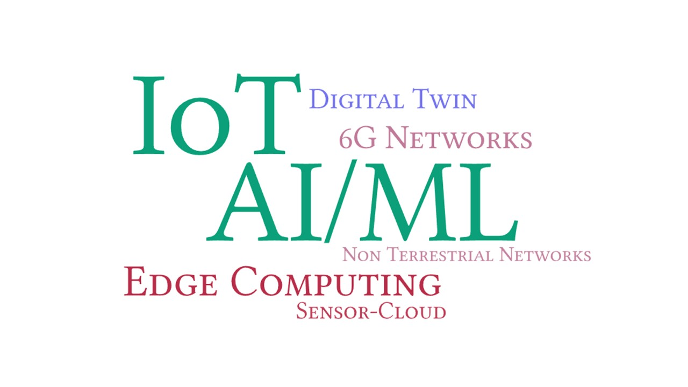

# Research

Our work is currently focused in applying AI/ML techniques for IoT and future networks. Specifically, we are working on designing intelligent solutions for Edge and Non-Terrestrial Networks, Wirelessly Powered IoT, 6G Network and Edge-Cloud-Continuum, and Digital Twin. Our lab is equipped with computing (GPU & edge) and communication modules, IoT development boards and various sensors.



## Highlighted





## All






